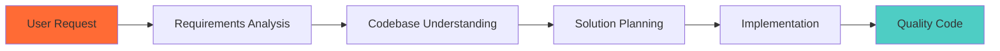

<div align="center">

# 🚀 Claude Skills Template

### **Consistent Development Framework for Any Project**

[](https://opensource.org/licenses/MIT)
[](https://www.python.org/downloads/)
[](https://docs.anthropic.com/en/docs/agents-and-tools/agent-skills)
[](https://github.com)

**A complete Skills system that guarantees methodology, protocol, and consistency in any development project, regardless of technology stack.**

[Features](#-features) • [Quick Start](#-quick-start) • [Documentation](#-documentation) • [Contributing](#-contributing)

---

</div>

## ✨ Features

<div align="center">

| 🎯 **Methodology** | 🔧 **Flexibility** | 🚀 **Efficiency** | 📚 **Documentation** |
|:---:|:---:|:---:|:---:|
| 4-phase structured protocol | Works with any tech stack | Setup in 5 minutes | Complete guides & examples |
| Systematic requirements analysis | Compatible with multiple AIs | Auto-configuration scripts | Step-by-step tutorials |
| Codebase understanding | Adaptable to your workflow | Quick verification tools | Real-world examples |

</div>

### 🎯 What This Template Provides

- ✅ **Methodological Consistency** - Same process for every project
- ✅ **Clear Protocols** - Structured approach to development
- ✅ **Better Results** - Professional code with simple prompts
- ✅ **Complete Understanding** - Full analysis of current and future state
- ✅ **Best Practices** - Industry-standard implementation
- ✅ **Universal Compatibility** - React, Vue, Angular, Node.js, Python, etc.
- ✅ **Multi-AI Support** - Claude, ChatGPT, Gemini, and more

---

## 📦 Included Skills

### 🎯 Core Skills System

<details>
<summary><b>1. 🎯 project_protocol</b> - Master Development Protocol</summary>

The orchestrator skill that coordinates the entire development process through 4 phases:
- **Requirements Analysis** → Understanding what's needed
- **Codebase Understanding** → Analyzing current state
- **Solution Planning** → Creating coherent implementation plan
- **Implementation** → Executing with quality standards

</details>

<details>
<summary><b>2. 📋 requirements_analyzer</b> - Structured Requirements Analysis</summary>

Systematically analyzes and structures user requirements:
- Main requirement extraction
- Functionality identification
- Constraint detection
- Dependency mapping
- Acceptance criteria definition
- Ambiguity resolution

</details>

<details>
<summary><b>3. 🔍 codebase_understanding</b> - Complete Codebase Analysis</summary>

Deep analysis of the current project state:
- Project structure mapping
- Technology stack identification
- Architecture pattern recognition
- Code patterns and conventions
- Relevant code location
- Configuration analysis

</details>

<details>
<summary><b>4. ⚙️ implementation_protocol</b> - Quality Implementation Guide</summary>

Ensures professional implementation:
- Respects existing architecture
- Follows project conventions
- Maintains code consistency
- Includes proper testing
- Complete documentation

</details>

---

## 🚀 Quick Start

### ⚡ 5-Minute Setup

```bash
# 1. Clone the template
git clone https://github.com/your-username/claude-skills-template.git my-project
cd my-project

# 2. Run automatic setup
./setup.sh        # Linux/Mac
# or
setup.bat         # Windows

# 3. Configure your API key
# Edit .env and add: ANTHROPIC_API_KEY=sk-ant-api03-...

# 4. Verify everything works
python test_skills.py

# 5. Start developing! 🎉
```

> 📖 **New to this?** Check out [GETTING_STARTED.md](GETTING_STARTED.md) for a detailed step-by-step guide.

### 🎨 Use as GitHub Template

1. Click **"Use this template"** on GitHub
2. Create your new repository
3. Follow the setup steps above

> 📚 See [docs/GITHUB_TEMPLATE_GUIDE.md](docs/GITHUB_TEMPLATE_GUIDE.md) for complete instructions.

---

## 📁 Project Structure

```
claude-skills-template/
├── 📁 skills/                      # Core Skills System
│   ├── project_protocol/          # Master orchestrator
│   ├── requirements_analyzer/    # Requirements analysis
│   ├── codebase_understanding/    # Codebase analysis
│   └── implementation_protocol/   # Implementation guide
│
├── 📁 examples/                    # Usage Examples
│   ├── usage_example.py           # Basic example
│   └── complete_example.py        # Advanced scenarios
│
├── 📁 .claude/                     # Claude Code IDE Config (Optional)
│   ├── skills/                    # Skills for auto-activation
│   ├── hooks/                     # Auto-activation hooks
│   └── skill-rules.json           # Pattern matching rules
│
├── ⚙️ Configuration Files
│   ├── .env.example               # Environment template
│   ├── requirements.txt           # Python dependencies
│   ├── setup.sh / setup.bat       # Auto-setup scripts
│   └── test_skills.py             # Verification tool
│
└── 📚 Documentation
    ├── GETTING_STARTED.md         # 🚀 Start here!
    ├── INTEGRATION_GUIDE.md       # Integration details
    └── docs/                       # Additional documentation
        ├── INDEX.md                # Complete file index
        └── ... (see docs/INDEX.md for complete list)
```

---

## 🎓 How It Works

<div align="center">



</div>

### 🔄 Development Workflow

1. **📋 Analysis Phase**
   - `requirements_analyzer` extracts and structures requirements
   - Identifies functionalities, constraints, and dependencies
   - Defines acceptance criteria

2. **🔍 Understanding Phase**
   - `codebase_understanding` analyzes current project state
   - Maps architecture, patterns, and technologies
   - Locates relevant existing code

3. **📐 Planning Phase**
   - `project_protocol` creates coherent implementation plan
   - Designs solution respecting existing architecture
   - Identifies components to create/modify

4. **⚙️ Implementation Phase**
   - `implementation_protocol` guides code writing
   - Follows project conventions and best practices
   - Ensures consistency and quality

---

## 📚 Documentation

### 🚀 Getting Started

| Document | Description | When to Use |
|:---------|:------------|:------------|
| **[GETTING_STARTED.md](GETTING_STARTED.md)** | 🎯 **START HERE** - Complete first-use guide with setup checklist | First time using the template |

### 🔧 Integration Guides

| Document | Description | When to Use |
|:---------|:------------|:------------|
| **[INTEGRATION_GUIDE.md](INTEGRATION_GUIDE.md)** | Complete integration guide | Setting up skills |
| **[docs/CLAUDE_CODE_INTEGRATION.md](docs/CLAUDE_CODE_INTEGRATION.md)** | Claude Code IDE auto-activation | Using Claude Code IDE |
| **[docs/USAGE_WITH_OTHER_AI.md](docs/USAGE_WITH_OTHER_AI.md)** | Adapt for other AIs | Using ChatGPT, Gemini, etc. |

### 📖 Reference & Advanced

| Document | Description |
|:---------|:------------|
| **[docs/INDEX.md](docs/INDEX.md)** | Complete file index and navigation |
| **[docs/RESOURCES.md](docs/RESOURCES.md)** | Additional resources and references |
| **[CONTRIBUTING.md](CONTRIBUTING.md)** | How to contribute |
| **[docs/GITHUB_TEMPLATE_GUIDE.md](docs/GITHUB_TEMPLATE_GUIDE.md)** | Using as GitHub template |

> 📑 **Can't find what you need?** Check [docs/INDEX.md](docs/INDEX.md) for complete navigation.

---

## 💡 Usage Examples

### Example 1: Simple Feature

```python
from anthropic import Anthropic
from examples.usage_example import create_development_request

# Simple requirement
requirement = "Add a logout button to the header"

response = create_development_request(requirement)
# Skills automatically analyze, plan, and implement!
```

### Example 2: Complex Feature

```python
requirement = """
I need a complete authentication system with:
- Email/password login
- User registration
- Password recovery
- JWT session management
- Protected routes
"""

response = create_development_request(requirement, project_path="./my-project")
# Complete analysis and implementation plan generated!
```

> 📖 See [examples/](examples/) for complete working examples.

---

## 🌟 Key Benefits

<div align="center">

### 🎯 **For Developers**
- **Consistency** - Same methodology across all projects
- **Quality** - Best practices enforced automatically
- **Speed** - Faster development with structured approach
- **Confidence** - Clear protocols reduce errors

### 🏢 **For Teams**
- **Standardization** - Everyone follows the same process
- **Onboarding** - New members understand quickly
- **Collaboration** - Shared methodology improves teamwork
- **Scalability** - Works for projects of any size

### 🚀 **For Projects**
- **Quality from Day 1** - Best practices from the start
- **Maintainability** - Consistent code is easier to maintain
- **Documentation** - Everything is well documented
- **Flexibility** - Adapts to any technology stack

</div>

---

## 🔗 Resources & Community

### 📚 Official Resources

- [Claude Skills Documentation](https://docs.anthropic.com/en/docs/agents-and-tools/agent-skills/overview) - Official guide
- [Claude Skills Best Practices](https://docs.anthropic.com/en/docs/agents-and-tools/agent-skills/best-practices) - Best practices
- [Skills Cookbook](https://github.com/anthropics/claude-cookbooks) - Official examples

### 🌟 Community Resources

- [Awesome Claude Skills](https://github.com/VoltAgent/awesome-claude-skills) - Curated skill collection
- [Claude Code Infrastructure Showcase](https://github.com/diet103/claude-code-infrastructure-showcase) - Auto-activation patterns (8.3k⭐)

> 📖 See [docs/RESOURCES.md](docs/RESOURCES.md) for complete resource list.

---

## 🤝 Contributing

We welcome contributions! This template is designed to grow with the community.

### How to Contribute

- 🐛 **Report Issues** - Found a bug? Let us know!
- 📝 **Improve Documentation** - Help others understand better
- ✨ **Add Features** - New skills or improvements
- 💡 **Share Examples** - Real-world use cases
- 🌍 **Translate** - Help reach more developers

See [CONTRIBUTING.md](CONTRIBUTING.md) for detailed guidelines.

---

## 📊 Use Cases

<div align="center">

| Use Case | Description | Perfect For |
|:---------|:------------|:------------|
| 🆕 **New Projects** | Start with quality from day 1 | Fresh development |
| 🔄 **Refactoring** | Understand and improve existing code | Code maintenance |
| 🎯 **Feature Development** | Add features consistently | Product development |
| 👥 **Team Projects** | Standardize methodology | Team collaboration |
| 📚 **Learning** | Understand best practices | Education |
| 🚀 **Rapid Prototyping** | Fast, quality prototypes | MVP development |

</div>

---

## 🎯 Supported Technologies

<div align="center">

### 🎨 Frontend Frameworks & Libraries


### 💻 Languages & Runtimes


### ⚙️ Backend Frameworks


### 🗄️ Databases


### ☁️ Cloud & DevOps


### 🧪 Testing & Quality


### 🎨 UI Libraries & Tools


### 🤖 AI Systems


### 📦 State Management


### 🔐 Authentication & Security


### 📡 API & Communication


### 🛠️ Build Tools & Bundlers


### 📱 Mobile Development


### 🎯 And Many More!

This template works with **any technology stack**. The skills are technology-agnostic and adapt to your specific needs.

</div>

---

## 📄 License

This project is licensed under the **MIT License** - see the [LICENSE](LICENSE) file for details.

You are free to:
- ✅ Use in commercial projects
- ✅ Modify and adapt
- ✅ Distribute
- ✅ Private use

---

## ⭐ Show Your Support

If this template helps you, please consider:

- ⭐ **Starring** this repository
- 🍴 **Forking** for your own use
- 📢 **Sharing** with your team
- 🐛 **Reporting** issues
- 💡 **Suggesting** improvements

---

<div align="center">

## 🚀 Ready to Get Started?

**[📖 GETTING_STARTED.md](GETTING_STARTED.md)** • **[🔧 INTEGRATION_GUIDE.md](INTEGRATION_GUIDE.md)** • **[📦 Use Template](https://github.com/your-username/claude-skills-template/generate)**

---

**Made with ❤️ for the developer community**

[Report Bug](https://github.com/your-username/claude-skills-template/issues) • [Request Feature](https://github.com/your-username/claude-skills-template/issues) • [View Documentation](docs/INDEX.md)

</div>
